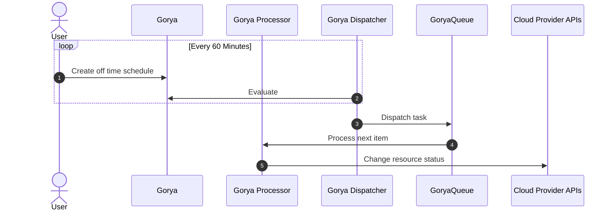

# Gorya

Schedule for EC2, RDS and EKS instances. A Golang port of [Doiintl's Zorya](https://github.com/doitintl/zorya).

## Setup

By default, in-mem sqlite is used but MySQL is recommended for production setup.

## How it works

