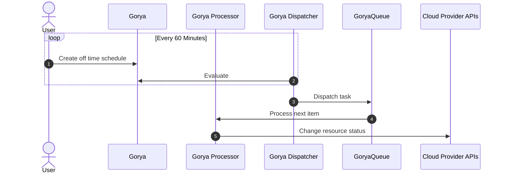

# Gorya

Schedule for EC2, RDS and EKS instances. A Golang port of [Doiintl's Zorya](https://github.com/doitintl/zorya).

[](https://raw.githubusercontent.com/nduyphuong/gorya/dev/LICENSE)
[](https://github.com/nduyphuong/gorya/actions)

## Building Gorya

### Software requirements

-   [go 1.20+]
-   [git]

## Setup your environments

By default, in-mem sqlite is used but MySQL is recommended for production setup.

#### Option 1: Set up with docker-compose
1. Create a new directory for project if not exists.
```bash
mkdir -p ~/go/src/github.com/nduyphuong/gorya
```
2. Clone the source code
```bash
cd ~/go/src/github.com/nduyphuong/gorya
git clone https://github.com/nduyphuong/gorya
```
3. Set up the stack with docker
```bash
cd ~/go/src/github.com/nduyphuong/gorya
docker-compose up -d
```
#### Option 2: Set up with helm

TBD

## How it works



[go 1.20+]: https://go.dev/doc/install
[git]: https://docs.github.com/en/get-started/quickstart/set-up-git
