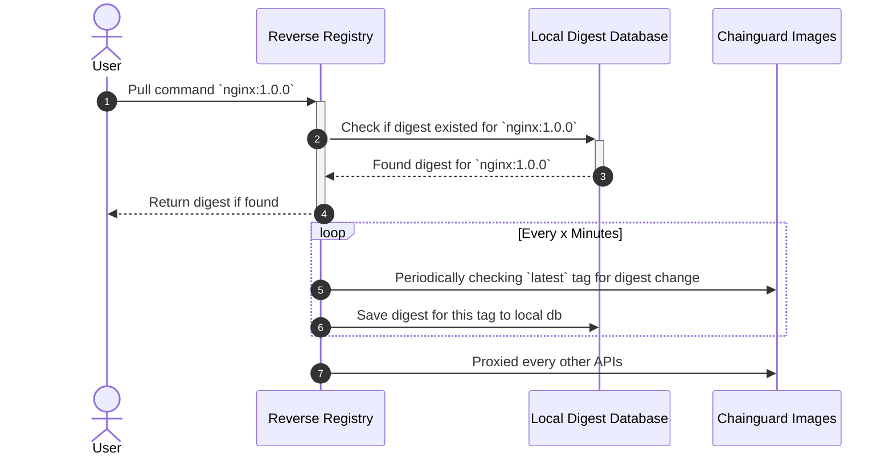

# Gorya

Schedule for EC2, RDS and EKS instances

## Setup

By default, in-mem sqlite is used but MySQL is recommended for production setup.

## How it works

```mermaid
sequenceDiagram
autonumber
actor U as User
participant RR as Reverse Registry
participant DB as Local Digest Database
participant CG as Chainguard Images
U->>+RR: Pull command `nginx:1.0.0`
RR->>+DB: Check if digest existed for `nginx:1.0.0`
DB-->>-RR: Found digest for `nginx:1.0.0`
RR-->>-U: Return digest if found

loop Every x Minutes
RR->>CG: Periodically checking `latest` tag for digest change
RR->>DB: Save digest for this tag to local db
end


RR->>CG: Proxied every other APIs

```
